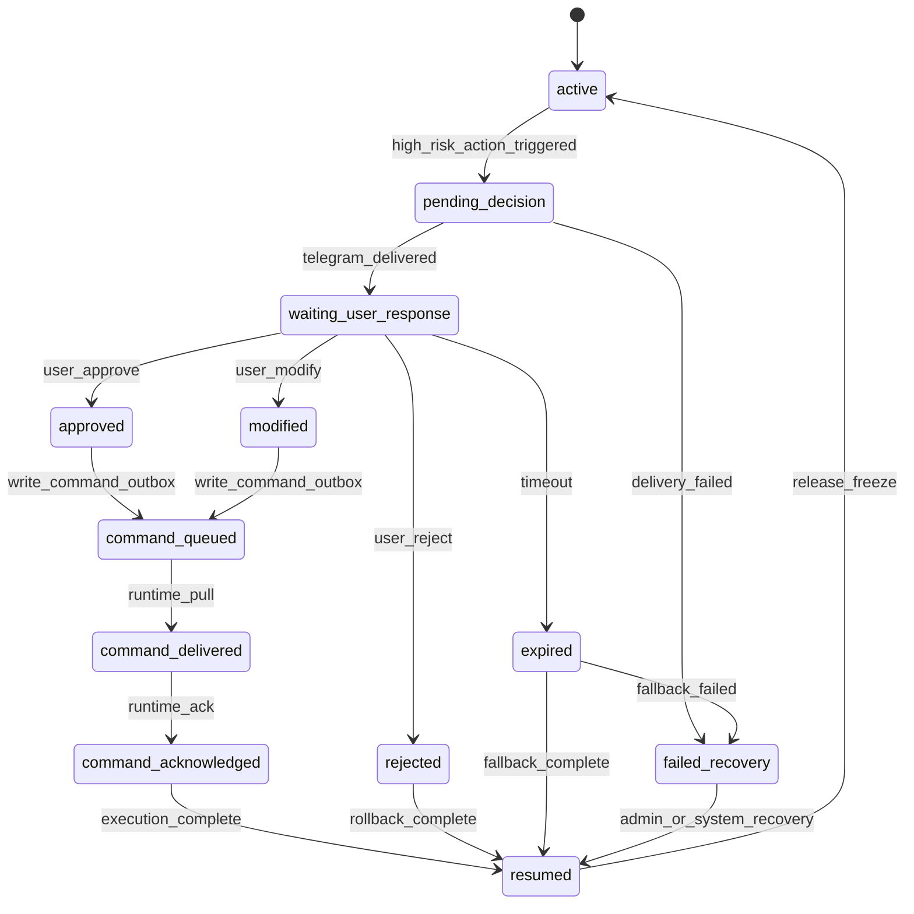

# Runtime Decision State Machine

## 状态定义

### active
- 含义：runtime 正常运行，可继续执行低风险自动动作与普通事件处理。
- 进入条件：
  - 无阻塞中的高风险 decision
  - 或高风险 decision 已完成恢复
- 退出条件：
  - 创建新的阻塞型 decision
- 不可变约束：
  - runtime 可以继续消费 command_outbox 中非阻塞指令

### pending_decision
- 含义：系统已识别出一个需要 approval 的高风险动作，并已冻结相关资源或相关动作路径。
- 进入条件：
  - 高风险动作命中 decision_rules
  - snapshot 已成功保存
  - 冻结账本记录已写入
- 退出条件：
  - Telegram 投递成功，进入 waiting_user_response
  - 投递失败，进入 failed_recovery 或重试队列
- 不可变约束：
  - 引发该 decision 的高风险动作不得继续推进

### waiting_user_response
- 含义：decision 已送达 Telegram，等待 user 明确响应。
- 进入条件：
  - decision 已成功投递到 telegram_primary
- 退出条件：
  - 收到 approve
  - 收到 reject
  - 收到 modified
  - 超时进入 expired
- 不可变约束：
  - decision 必须持有 correlation_id
  - snapshot 不可变更

### approved
- 含义：user 已批准，等待生成结构化 command_outbox 指令。
- 进入条件：
  - 有效 approval=approve
- 退出条件：
  - command_outbox 写入成功后进入 command_queued
- 不可变约束：
  - 不允许再次接受不同终局响应

### rejected
- 含义：user 已拒绝，系统必须执行回滚或资源解冻。
- 进入条件：
  - 有效 approval=reject
- 退出条件：
  - 解冻/回滚完成，进入 resumed
- 不可变约束：
  - 不允许产生执行命令

### modified
- 含义：user 批准但附带结构化修改，例如 quantity、budget_cap、route_risk。
- 进入条件：
  - 有效 approval=modified
- 退出条件：
  - command_outbox 写入成功后进入 command_queued
- 不可变约束：
  - 仅允许白名单 patch 字段

### expired
- 含义：decision 超时未响应，系统进入预定义 fallback。
- 进入条件：
  - 当前时间超过 timeout_seconds
- 退出条件：
  - fallback 完成后进入 resumed
  - fallback 失败时进入 failed_recovery
- 不可变约束：
  - 必须写审计日志和 fallback 结果事件

### command_queued
- 含义：结构化命令已经写入 command_outbox，等待 runtime 拉取。
- 进入条件：
  - approved 或 modified 的 command_outbox 成功写入
- 退出条件：
  - runtime 拉取命令后进入 command_delivered
- 不可变约束：
  - command_outbox 记录必须包含 correlation_id、decision_id、runtime_id

### command_delivered
- 含义：runtime 已收到命令，但尚未回执执行确认。
- 进入条件：
  - runtime 成功拉取 command_outbox 项
- 退出条件：
  - runtime 写回 ack 后进入 command_acknowledged
- 不可变约束：
  - 同一 command 不应重复派送给同一 runtime，除非发生明确重试

### command_acknowledged
- 含义：runtime 已确认接收该命令。
- 进入条件：
  - runtime 写入 command ack
- 退出条件：
  - 后续执行链完成后进入 resumed
- 不可变约束：
  - ack 必须绑定 correlation_id

### resumed
- 含义：该 decision 链路已完成，runtime 回到 active。
- 进入条件：
  - reject 回滚完成
  - expired fallback 完成
  - approved/modified 的执行链完成并释放冻结
- 退出条件：
  - 新阻塞 decision 出现
- 不可变约束：
  - 该 decision 不得再次触发恢复

### failed_recovery
- 含义：decision 流程中的回滚、解冻、命令派发或恢复过程失败。
- 进入条件：
  - fallback 失败
  - rollback 失败
  - command_outbox/ack 不一致且重试失败
- 退出条件：
  - admin 或系统恢复成功后进入 resumed 或 active
- 不可变约束：
  - 必须触发 admin 告警
  - 相关冻结资源不能静默丢失

## 状态转移图

## 每个状态的进入条件、退出条件、不可变约束

### active
- 进入条件：无悬挂中的阻塞 decision。
- 退出条件：命中高风险审批规则。
- 不可变约束：低风险自动动作可继续执行。

### pending_decision
- 进入条件：snapshot 已保存、冻结账本已落地。
- 退出条件：投递 Telegram 成功或恢复失败。
- 不可变约束：禁止推进关联高风险动作；低风险动作按下文策略处理。

### waiting_user_response
- 进入条件：Telegram 投递成功。
- 退出条件：收到有效 user 响应或超时。
- 不可变约束：snapshot 固定，approval 窗口固定，correlation_id 固定。

### approved / modified / rejected / expired
- 进入条件：由 waiting_user_response 单向流入。
- 退出条件：回滚或 command_outbox 写入完成。
- 不可变约束：一个 decision 只能存在一个终局结果。

### command_queued / command_delivered / command_acknowledged
- 进入条件：approved 或 modified 形成结构化命令。
- 退出条件：runtime 逐步拉取并回执。
- 不可变约束：command_outbox 写入与 ack 链必须可审计，不能跳步。

### resumed
- 进入条件：冻结释放或执行链完成。
- 退出条件：新的阻塞 decision 再次出现。
- 不可变约束：不能对同一 decision 重复恢复。

### failed_recovery
- 进入条件：恢复链任一关键步骤失败。
- 退出条件：admin 干预或系统重试成功。
- 不可变约束：必须保持冻结资源可追溯，必须产生告警。

## 与 Gateway / Telegram / Command Outbox 的关系

### Gateway
- 负责接收高风险动作触发结果。
- 负责写入 decision 记录、snapshot、冻结账本记录。
- 负责调用 Telegram 投递。
- 不直接执行 claw 动作。

### Telegram
- 只负责 user 决策交互。
- 不直接改 world state。
- 所有 user 响应最终都必须映射成结构化 approval 结果。

### command_outbox
- 是 approval 结果传递给 runtime 的唯一结构化桥梁。
- approved / modified 的结果都必须转为 command_outbox 项。
- rejected / expired 一般不写执行命令，但要写审计和恢复记录。

## 运行策略说明

### 世界整体继续跑，但相关高风险动作被冻结
- 世界 tick 继续推进。
- 只有与该 decision 直接相关的高风险动作路径被冻结。
- 其它 runtime、其它 sector、其它组织不受阻塞。

### 低风险动作是否可继续
- 默认策略：可以继续。
- 限制条件：
  - 如果低风险动作依赖被冻结资源，则必须暂停。
  - 如果低风险动作会改变当前 decision 的必要前提（例如占用同一批 rare resource），则必须暂停。
- 推荐实现：以 `resource_lock_scope` 或 `decision_lock_scope` 为准，而不是整个 runtime 全冻结。

### 超时后如何 fallback
- 所有 decision 必须有显式 `timeout_behavior`。
- fallback 只能来自 `decision_rules.yaml` 的结构化配置。
- 常见 fallback：
  - reject_and_release_frozen_commitment
  - keep_original_route
  - hold_resource_and_notify
  - preserve_shutdown_and_alert_admin

### 为什么需要 snapshot
- snapshot 是高风险动作进入审批前的冻结基线。
- 它保证：
  - 回滚有依据
  - 审计可验证
  - replay 能说明“当时为什么触发审批”
- 没有 snapshot，高风险动作无法安全冻结、恢复和审计。

### 为什么需要 correlation_id
- correlation_id 用来串联：
  - decision
  - Telegram 消息
  - approval 结果
  - command_outbox
  - runtime ack
  - 恢复日志
- 没有 correlation_id，就无法稳定做幂等、审计和恢复。

### 如何防止重复恢复
- 每个 decision 只允许一个终局状态。
- resumed 必须持久化 `recovery_applied=true` 或同类不可变标记。
- 重复到达的 Telegram 消息只能返回既有结果，不再重新执行恢复。

### 如何处理 Telegram 成功但 runtime 未拉取 command 的情况
- command_outbox 仍然保留该命令。
- runtime 在下次轮询时继续拉取。
- 超过最大未消费时长后：
  - 触发 `runtime_command_delivery_stale` 告警
  - 可由 admin 发起重投递或恢复流程
- command_outbox 项必须有 `expires_at` 与 `delivery_attempts` 字段。

## 时序示例

### 示例 1：正常审批恢复
1. runtime 触发高风险 trade。
2. Gateway 创建 decision，保存 snapshot，写入 frozen_commitment。
3. Telegram 向 user 发送审批请求。
4. user 发送 `/approve dec_1001`。
5. Gateway 记录 approval=approved，写 command_outbox。
6. runtime 轮询到该 command_outbox 项。
7. runtime 执行命令并 ack。
8. 系统释放冻结，写 settlement 与审计日志。
9. decision 状态进入 resumed，runtime 回到 active。

### 示例 2：超时自动 fallback
1. runtime 触发 rare_resource_commit。
2. Gateway 创建 decision、snapshot 和冻结记录。
3. Telegram 投递成功，但 user 未响应。
4. 到达 timeout_seconds。
5. 系统根据 timeout_behavior 执行 `hold_resource_and_notify`。
6. 冻结资源保持锁定但不提交到目标动作。
7. 写入 expired 审计日志和 fallback 事件。
8. decision 进入 resumed，runtime 恢复继续执行其它低风险动作。
